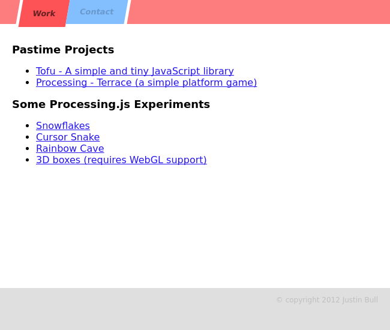

# Website 2012

Personal website where I showcase some of my work.

### How To Use

This website uses AJAX requests to load page content.
Therefore, you must use an http server to avoid CORS errors.

```
git clone https://github.com/jabes/website-2012.git
cd website-2012
python3 -m http.server
```

You can view the website at [http://0.0.0.0:8000/](http://0.0.0.0:8000/)

### Screenshots

